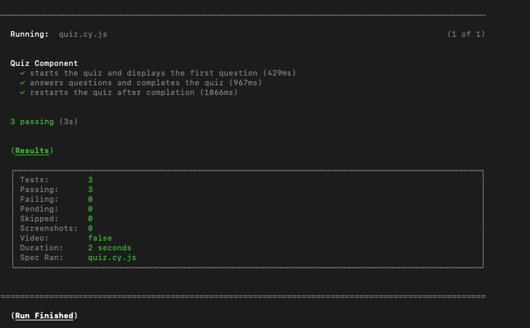
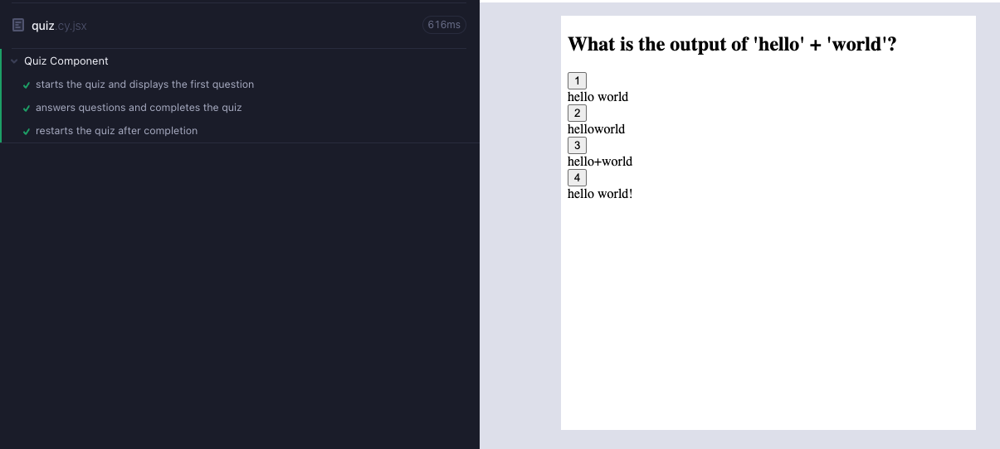

# component_E2E_tests
## Description
The functionality hasn't changed on this app, but a component and E2E test were both created using Cypress.

## Usage
You can run the app yourself and use "npm run test" to start the tests, or you can watch a short demo of the tests here: https://drive.google.com/file/d/1hdwLbdlJnBcLaKwW9ZdebWJXRDI-gwcB/view?usp=sharing

Screenshot 1:  
  

Screenshot 2:  
  

## Credits & How to Contribute
These tests were created by Johann Zaroli. Please contact me on GitHub at Jzaroli with any questions or requests.

## License
MIT License

Copyright (c) <2024>

Permission is hereby granted, free of charge, to any person obtaining a copy of this software and associated documentation files (the "Software"), to deal in the Software without restriction, including without limitation the rights to use, copy, modify, merge, publish, distribute, sublicense, and/or sell copies of the Software, and to permit persons to whom the Software is furnished to do so, subject to the following conditions:

The above copyright notice and this permission notice shall be included in all copies or substantial portions of the Software.

THE SOFTWARE IS PROVIDED "AS IS", WITHOUT WARRANTY OF ANY KIND, EXPRESS OR IMPLIED, INCLUDING BUT NOT LIMITED TO THE WARRANTIES OF MERCHANTABILITY, FITNESS FOR A PARTICULAR PURPOSE AND NONINFRINGEMENT. IN NO EVENT SHALL THE AUTHORS OR COPYRIGHT HOLDERS BE LIABLE FOR ANY CLAIM, DAMAGES OR OTHER LIABILITY, WHETHER IN AN ACTION OF CONTRACT, TORT OR OTHERWISE, ARISING FROM, OUT OF OR IN CONNECTION WITH THE SOFTWARE OR THE USE OR OTHER DEALINGS IN THE SOFTWARE.
